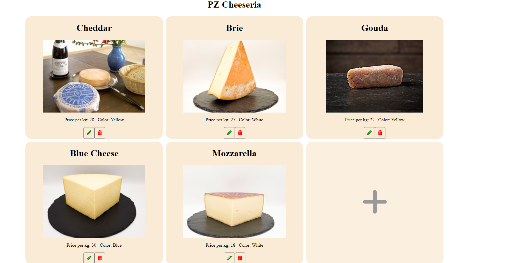

# PzCheeseriaWebApp

This project was generated with [Angular CLI](https://github.com/angular/angular-cli) version 18.2.6.

## Development server

Run `ng serve` for a dev server. Navigate to `http://localhost:4200/`. The application will automatically reload if you change any of the source files.

## Code scaffolding

Run `ng generate component component-name` to generate a new component. You can also use `ng generate directive|pipe|service|class|guard|interface|enum|module`.

## Build

Run `ng build` to build the project. The build artifacts will be stored in the `dist/` directory.

## Running unit tests

cd to ./pz-cheeseria-web-app and
Run `ng test` to execute the unit tests via [Karma](https://karma-runner.github.io).

## Here's how it looks

Instructions to use:

- Click on a Cheese item to buy and calculate price.
- Click on the green pencil icon to edit.
- Click on the red bin to delete
- Click on the tile with the plus symbol to add new cheese.

## Further help

To get more help on the Angular CLI use `ng help` or go check out the [Angular CLI Overview and Command Reference](https://angular.dev/tools/cli) page.
